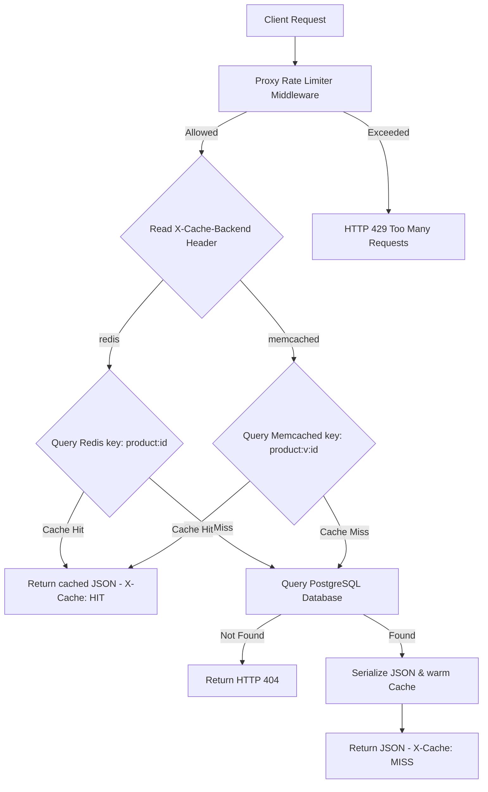
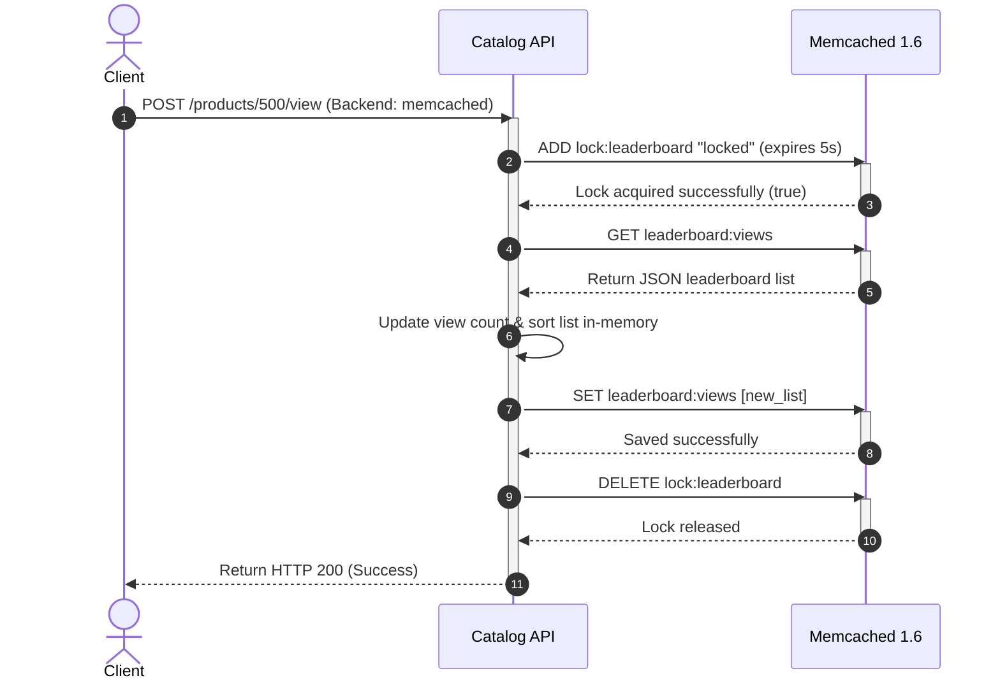

# Comparative Caching Layers: Redis 7 vs Memcached 1.6

A production-grade, high-performance Product Catalog API proxy demonstrating and comparing advanced in-memory caching patterns. This system implements identical business requirements across both **Redis 7** and **Memcached 1.6** caches to analyze their differences in raw performance, consistency guarantees, concurrency handling, and memory footprint.

---

## 🚀 Tech Stack

*   **Runtime Environment**: Node.js (v22.x, Alpine Linux)
*   **Language**: TypeScript (v5.x)
*   **Framework**: Express (v4.x)
*   **Database**: PostgreSQL 15 (seeded with 100,000 products, each payload ~2KB)
*   **Caching Systems**:
    *   **Redis 7.0**: Used for atomic sorted sets, multi-field hash mapping, and Lua scripting.
    *   **Memcached 1.6**: Used for high-throughput multi-threaded string storage, slab allocation, and namespace versioning.
*   **Orchestration**: Docker & Docker Compose
*   **Benchmarking Tools**: `memtier_benchmark` (RedisLabs), Python 3 concurrent thread engines.

---

## 📂 Project Structure

```text
redis-vs-memcached-caching-benchmark/
├── .env.example            # Blueprint for environment configuration
├── .gitignore              # Files ignored by git (node_modules, .env, dist)
├── Dockerfile              # Multi-stage production container build
├── README.md               # User guide & performance analysis
├── architecture.md         # Detailed system design & cache topologies
├── projectdocumentation.md # Feature descriptions & testing validation
├── docker-compose.yml      # Orchestrates Postgres, Redis, Memcached, and App
├── package.json            # npm package dependencies and build tasks
├── tsconfig.json           # TypeScript compilation options
├── db-init/
│   └── init.sql            # Seeding script creating 100,000 product rows
├── results/
│   ├── redis_bench.txt     # Raw memtier_benchmark output for Redis
│   └── memcached_bench.txt # Raw memtier_benchmark output for Memcached
├── scripts/
│   ├── run_benchmarks.ps1  # Automated PowerShell benchmark runner
│   ├── seed_caches.js      # Bulk database-to-cache warming script
│   └── verify_consistency.py # Multi-threaded Python race-condition testing suite
├── src/
│   ├── index.ts            # Bootstraps Express and opens invalidation Pub/Sub listeners
│   ├── app.ts              # API routers and business endpoints
│   ├── config.ts           # Type-safe environment loader
│   ├── db.ts               # Postgres Connection pool management
│   ├── cache/
│   │   ├── base.ts         # Unified interface contract (ICacheBackend)
│   │   ├── factory.ts      # Selects active cache using request headers
│   │   ├── redis.ts        # Redis wrapper (Lua limiter, ZSET leader, HGETALL sessions)
│   │   └── memcached.ts    # Memcached wrapper (Lock-protected leaderboard, versioning)
│   ├── middleware/
│   │   └── rate-limiter.ts # API Proxy rate-limiting gateway
│   └── types/
│       └── memjs.d.ts      # TypeScript declarations for the memjs library
└── submission.json         # Structured benchmark statistics for automated comparison
```

---

## 📈 System Flow & Execution Diagrams

### 1. Request Routing & Caching Flow (GET `/products/:id`)
This diagram shows how requests route through the proxy middleware to PostgreSQL or the selected active caching layer.



### 2. Distributed Locking Workflow (POST `/products/:id/view`)
To avoid race conditions on the leaderboard update in Memcached (which lacks native sorting), the proxy acquires a distributed lock before updating the serialized list.



---

## 🛠️ Setup and Installation

### 1. Configure the Environment
Clone the project repository and copy the environment template:
```bash
cp .env.example .env
```

### 2. Spin Up Containers
Launch PostgreSQL, Redis, Memcached, and the Node application together:
```bash
docker compose up --build -d
```
*Note: The API container is configured to wait until the PostgreSQL database container health check passes (which checks that exactly **100,000 product rows** have been seeded).*

### 3. Verify Seeding & Status
Confirm all containers are healthy and running:
```bash
docker ps
```
Verify the number of products seeded in Postgres:
```bash
docker exec -it catalog_db psql -U postgres -d catalog -c "SELECT COUNT(*) FROM products;"
```
*(Should return exactly `100000`).*

---

## 💻 API Usage & Verification

All endpoints dynamically route commands to Redis or Memcached based on the `X-Cache-Backend` header.

### 1. Get Product Details (GET `/products/:id`)
Fetches product details (returns ~2KB payload).
```bash
# Redis Backend (MISS on first try, HIT on subsequent requests)
curl -i -H "X-Cache-Backend: redis" http://localhost:3000/products/100

# Memcached Backend
curl -i -H "X-Cache-Backend: memcached" http://localhost:3000/products/100
```

### 2. Update Product (POST `/products/:id`)
Updates product in Postgres and invalidates the cache (triggers Redis Pub/Sub broadcast, or increments Memcached global version key).
```bash
# PowerShell invocation avoiding command-line quote expansions
Invoke-RestMethod -Method Post -Uri "http://localhost:3000/products/100" -Headers @{"X-Cache-Backend"="redis"} -ContentType "application/json" -Body '{"name":"Premium Updated Item"}'
```

### 3. Update & Read Leaderboard
```bash
# Register a view
curl -i -X POST http://localhost:3000/products/100/view

# Fetch top 10 most viewed items
curl -i http://localhost:3000/leaderboard
```

### 4. Manage User Sessions
```bash
# Update last_login field in session 550
Invoke-RestMethod -Method Post -Uri "http://localhost:3000/session/550" -Headers @{"X-Cache-Backend"="redis"} -ContentType "application/json" -Body '{"field":"last_login", "value":"2026-06-26T12:00:00Z"}'

# Fetch session details
curl -i http://localhost:3000/session/550
```

---

## ⚡ Performance & Consistency Verification

### 1. Benchmarking Suite
We automate `memtier_benchmark` runs using docker containers to benchmark both caching backends.
*   **On Windows (PowerShell)**:
    ```powershell
    powershell -File scripts/run_benchmarks.ps1
    ```
*   **On Linux / Git Bash**:
    ```bash
    bash run_benchmarks.sh
    ```
*The metrics are compiled in `results/redis_bench.txt` and `results/memcached_bench.txt`.*

### 2. Concurrency & Race Condition Tests
We run concurrent threads executing leaderboard views and rate limiter requests to prove caching guarantees:
```bash
python scripts/verify_consistency.py
```
This script populates `submission.json` and outputs:
*   **Redis ZSET**: 0 lost increments (atomic Sorted Sets).
*   **Memcached with Lock**: 0 lost increments (distributed locking).
*   **Memcached without Lock**: ~30-60 lost increments (concurrency race condition).
