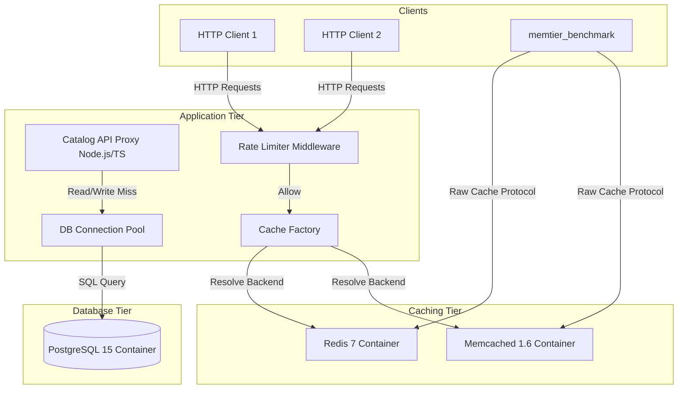
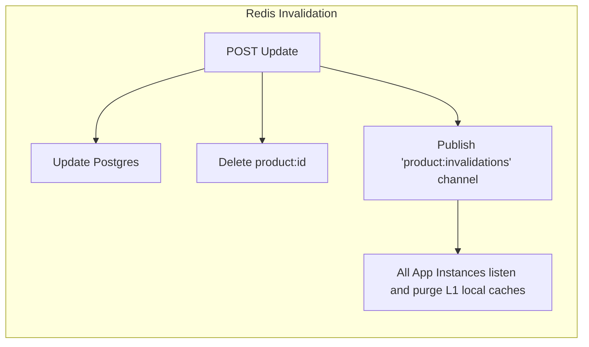
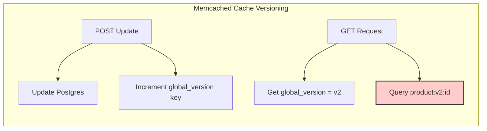
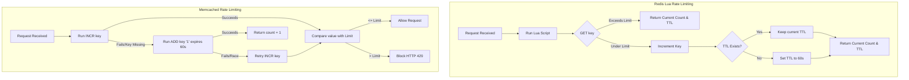

# System Architecture: Redis vs. Memcached comparative analysis

This document provides a comprehensive analysis of the system architecture, component design, data flow topology, and the technical trade-offs between Redis 7 and Memcached 1.6 in the Product Catalog API.

---

## 1. Project Objective

The core objective of this project is to implement, evaluate, and benchmark identical business requirements using two distinct in-memory architectures:
1.  **Redis 7 (Data Structure Topology)**: Moving computation closer to the data using advanced data structures (ZSET, Hash) and atomic operations (Lua).
2.  **Memcached 1.6 (High-Throughput Key-Value Topology)**: Utilizing a simpler key-value paradigm coupled with multi-threaded execution and client-side logic orchestration (distributed locking, cache versioning namespaces).

---

## 2. System Architecture Layout

The application functions as a high-performance proxy that abstracts caching operations behind a unified interface (`ICacheBackend`). Depending on the request headers or configurations, database lookups are supplemented by cache reads and writes.

---

## 3. Cache Design Topologies & Patterns

### 1. Product Invalidation Patterns
A critical challenge in distributed caching is maintaining cache consistency during database updates. We compare two distinct approaches:

*   **Redis (Pub/Sub Invalidation)**:
    *   When a product is updated, the active caching layer deletes the key `product:<id>`.
    *   Simultaneously, the API publishes the invalidation event to a Redis channel. Any subscribed application instance receives this broadcast and can purge local L1 (in-memory) caches immediately.
*   **Memcached (Cache Versioning Namespace)**:
    *   Since Memcached lacks a pub/sub mechanism, cache keys are constructed as `product:v<version>:<id>`.
    *   A single global key `product:global_version` maintains the active namespace.
    *   When an update occurs, the global version key is incremented (`product:global_version = version + 1`). This immediately shifts the key namespace for subsequent queries, rendering all cached entries obsolete without requiring key-by-key deletions.

---

## 4. Key Modules & Technical Choices

### Core Modules
1.  **Proxy Rate Limiter (`src/middleware/rate-limiter.ts`)**:
    *   First line of defense against request flooding.
    *   Extracts client IP or `X-User-Id` to keep rate records.
    *   Injects headers (`X-RateLimit-Limit`, `X-RateLimit-Remaining`, `X-RateLimit-Reset`).
2.  **Database Connection Pool (`src/db.ts`)**:
    *   Manages connection instances, reducing connection establishment overhead for database operations.
3.  **Cache Factory (`src/cache/factory.ts`)**:
    *   Implements the Strategy Pattern to dynamically route cache read/write tasks to Redis or Memcached based on the `X-Cache-Backend` header.
4.  **Redis Backend Wrapper (`src/cache/redis.ts`)**:
    *   Wraps the Redis 7 client. Executes Lua scripts for atomic operations and handles sorted sets for the leaderboard.
5.  **Memcached Backend Wrapper (`src/cache/memcached.ts`)**:
    *   Wraps the Memcached 1.6 client (`memjs`). Implements the distributed locking cycle (exponential backoff retry loop) and serialized sessions.

---

## 5. Technical Comparison: Redis vs. Memcached

| Architectural Feature | Redis 7.0 | Memcached 1.6 |
| :--- | :--- | :--- |
| **Execution Model** | Single-threaded event loop (for command execution) | Multi-threaded event loop (allocates to worker cores) |
| **Data Structures** | Rich (Strings, Hashes, Lists, Sets, Sorted Sets, Streams) | Simple Strings (Max payload size 1MB) |
| **Atomicity** | Atomic single commands, Lua Scripts, MULTI/EXEC | Single-key atomic operations (Incr, Decr, Add, CAS) |
| **Concurrency Guarantees** | Implemented on cache server (serialized execution) | Client-orchestrated locking (Add retry loops, CAS) |
| **Memory Allocation** | Dynamic memory allocation (glibc/jemalloc) | Slab Allocation (Pre-allocated chunk sizes, zero fragmentation) |
| **Pub/Sub Mechanism** | Native (Publish/Subscribe/Pattern subscribe) | Lacks Pub/Sub (requires versioning or version keys) |

### Pros & Cons Analysis

#### Redis
*   **Pros**:
    *   Rich data types reduce logic in the application tier (e.g. `ZSET` sort).
    *   Atomic execution model (Lua scripts) completely eliminates concurrency race conditions.
    *   Individual hash field updates save bandwidth and CPU cycles.
*   **Cons**:
    *   Single-threaded bottleneck: expensive operations (like `KEYS *`) block the entire server.
    *   Higher memory metadata overhead per key.

#### Memcached
*   **Pros**:
    *   Scales horizontally across multiple CPU cores in raw workloads.
    *   Extremely light memory overhead per key.
    *   Zero memory fragmentation due to Slab Allocation.
*   **Cons**:
    *   No native complex structures: sorting and array manipulations must be handled in application code.
    *   No transactional blocks: requires client-side distributed locking or CAS checks, introducing network overhead.
    *   No persistence options.

---

## 6. Execution & Data Flow Topology

### Rate Limiter Execution Flow
This diagram details the difference in rate limiter verification between Redis (Lua script) and Memcached (check-add-increment).

